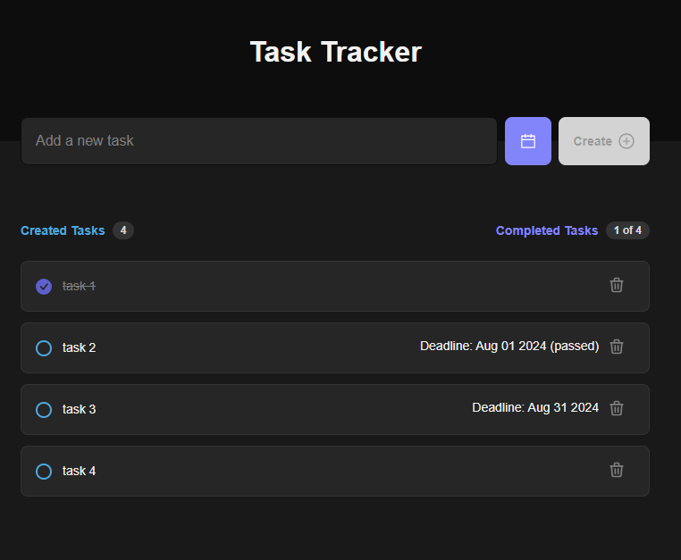
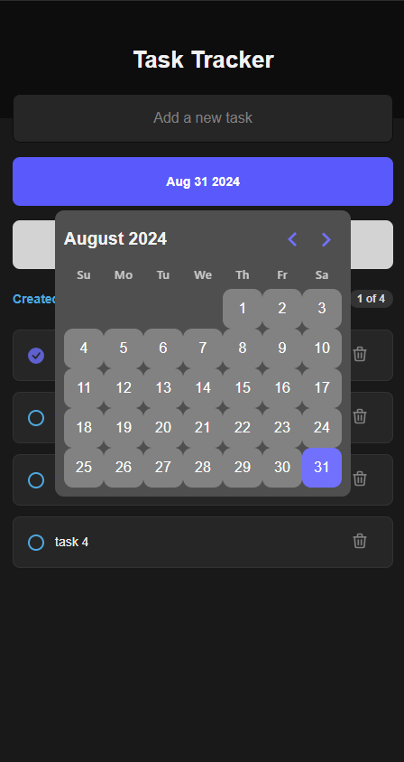

# A Simple Task Tracker site 

### A simple responsive task recording site, built with React Vite + TS (with React DayPicker lib).

It records tasks, if checked then completed task, able to delete task, and records deadline if applied. 

    
note: initial purpose is for 
BCIT react course comp 3013's lab 5